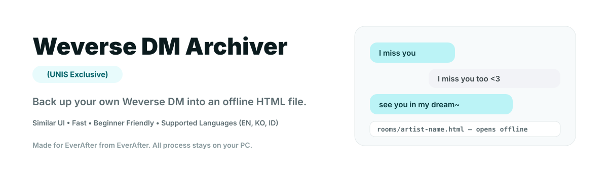
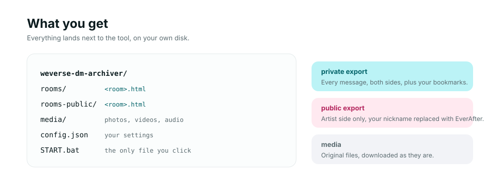
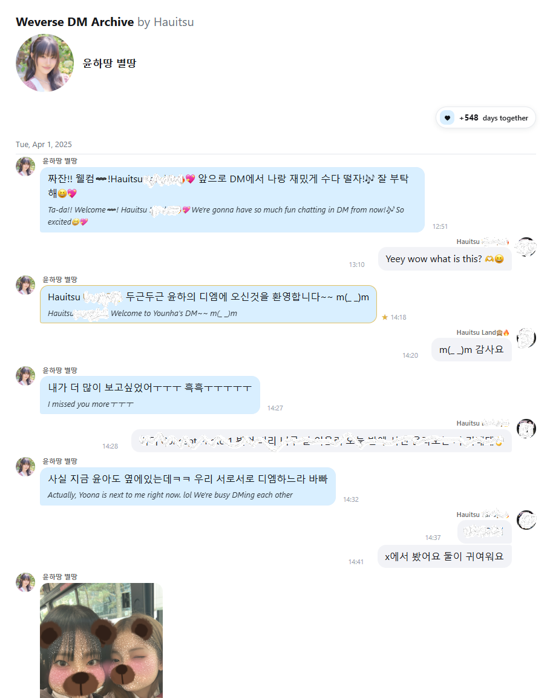
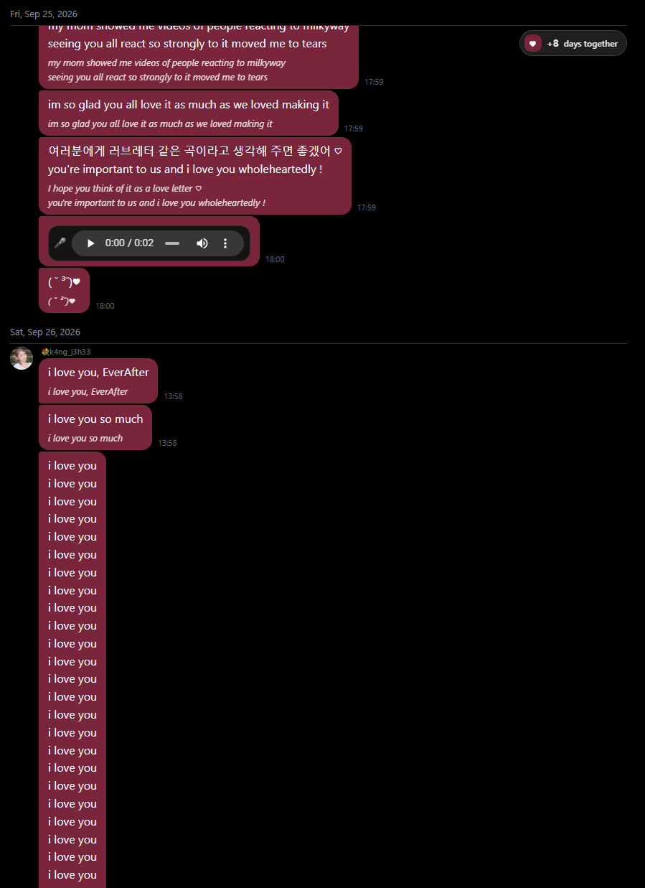
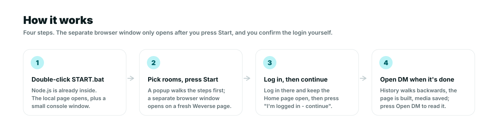
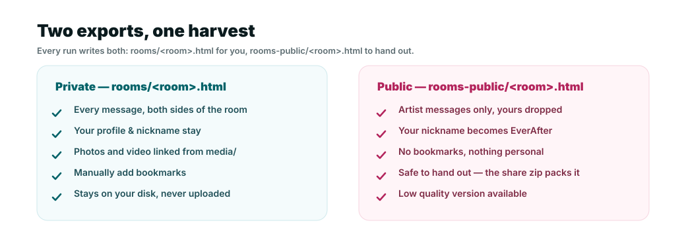
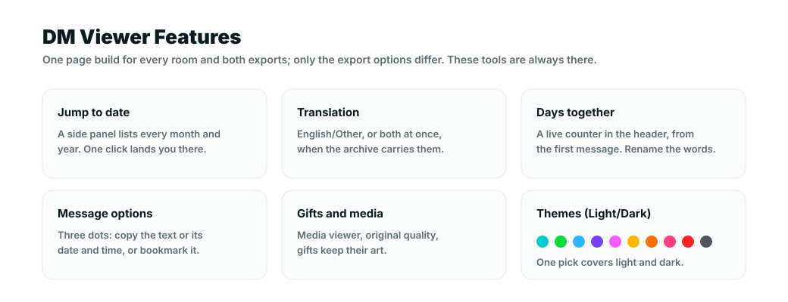

# Weverse DM Archiver (UNIS Exclusive)

[English](README.md) · 한국어 · [Bahasa Indonesia](README.id.md)



Weverse DM은 앱 안에만 있고 다른 곳에는 없습니다. 이 도구는 그것을 당신의 컴퓨터에, 언제든 열 수
있는 페이지로 저장합니다: 오프라인에서, 어떤 브라우저에서든, 모든 메시지와 사진, 동영상, 음성
메시지를 담고, 대화는 실제 순서 그대로 정리됩니다.

어디에도 업로드되지 않고, 만들 계정도 없습니다. 한 번의 작업이 끝나면 당신의 디스크에 평범한 파일이
남습니다 - 보관하거나, 다른 드라이브로 복사하거나, 원할 때 지우면 됩니다.

> **바로 사용할 수 있습니다.** 압축을 풀고 - Node.js와 ffmpeg는 이미 안에 들어 있습니다 - `START.bat`을
> 두 번 클릭한 뒤 보관할 방을 고르고 **Start**를 누르고, 열린 창에서 로그인한 다음
> **I'm logged in - continue**를 누르면 됩니다.
> 실제 방 하나가 이미 이 과정을 거쳤습니다:
> 18개월 동안 고유 메시지 9,574개, 그중 4,119개가 아티스트 쪽, 미디어 파일 1,478개
> (사진 1,444, 동영상 30, 오디오 4), 약 2.5 GB.

## 받게 되는 것



방 하나를 넣으면 페이지 하나가 나옵니다 - 몇 가지 덤도 함께:

- **대화 전체가 담긴 페이지.** 당신의 메시지와 아티스트의 메시지가 순서대로, 사진, 동영상, 음성
  메시지가 보내진 자리에 그대로, 시간은 당신의 시간대 기준으로 들어갑니다. 방마다 파일 하나: 두 번
  클릭하면 인터넷 없이 브라우저에서 열립니다.
- **공유할 수 있는 두 번째 사본.** 아티스트 쪽만 담기고 당신의 닉네임은 바뀌므로 다른 사람에게
  건네도 안전합니다.
- **방 전체의 zip**, 폴더 대신 파일 하나를 보내고 싶을 때 - 받는 사람을 위해 세 언어로 된 짧은
  `README.txt`가 함께 들어 있습니다.
- **같은 대화의 텍스트판과 데이터판** (방마다 Markdown 파일 하나, 데이터 파일 하나), 다른 방식으로
  읽거나 처리하고 싶은 사람을 위해.

모든 결과물은 이 도구가 있는 폴더에 남습니다 - `rooms/`, `rooms-public/`, `media/`, `share/`.
도구 자체의 브라우저 프로필(로그인하는 창)은 `%LOCALAPPDATA%` 아래에 따로 보관되어 평소 쓰는
브라우저와 분리됩니다.

## 보관된 DM 미리보기

보관이 끝난 방 하나는 이렇게 생겼습니다 - 인터넷도 위버스 계정도 없이 내 디스크에서 바로 여는
HTML 파일 하나입니다:





## 빠른 시작



짧은 다섯 단계이고 설치할 것은 없습니다: **Node.js와 ffmpeg는 다운로드 안에 이미 들어 있습니다**.

이 문서의 버튼 이름은 영어 표기를 씁니다. 도구 인터페이스를 한국어로 쓰면 버튼은 **시작**(Start),
**중지**(Stop), **DM 열기**(Open DM), **폴더 열기**(Open folder), **공유**(Share)로 표시됩니다.

### 1. 내려받아 압축 풀기

[zip 내려받기](https://github.com/Hauitsu/weverse-dm-archiver/releases/latest/download/weverse-dm-archiver.zip)
후 원하는 폴더에 압축을 풉니다. 예를 들어 `D:\weverse-archive`.

당신이 쓸 수 있는 곳에 두세요. 아카이브는 같은 폴더 안에 기록되므로 `Program Files` 같은 곳은
거부합니다 - 바탕 화면, 문서, 다른 드라이브, USB 메모리 모두 괜찮습니다.

설치할 것은 이것뿐입니다: 이 zip은 자체 Node.js를 품고 있습니다. 저장소에서 받은 "소스 사본"만
컴퓨터에 Node.js가 설치되어 있어야 합니다
([필요한 것](#필요한-것-그리고-하지-않는-것) 참고).

### 2. `START.bat`을 두 번 클릭

도구가 브라우저에 자기 페이지를 엽니다. 보통 `http://127.0.0.1:8787`입니다. 작은 콘솔 창도 함께
열리는데, 무시해도 됩니다.

그 주소가 이미 사용 중이면 도구가 다른 주소를 고르고, 콘솔 창이 사용한 주소를 출력합니다.

### 3. 보관할 방을 고르고 Start 누르기

짧은 팝업이 다음 단계를 다시 알려 줍니다. 읽고 확인하면 다음 창이 열립니다.

### 4. 거기서 로그인

별도의 브라우저 창이 새 Weverse 페이지로 열립니다. 평소처럼 로그인하고 그 창은 열어 두세요.

그다음 이 도구의 페이지로 돌아와 **I'm logged in - continue**를 누릅니다. 이 버튼은 지난번에
로그인한 상태가 남아 있어도 매번 눌러야 합니다 - 저장된 로그인은 만료될 수 있고, 그 창이 정말
로그인되었는지는 당신만 볼 수 있습니다.

### 5. 끝날 때까지 기다리기

기록은 최신 메시지부터 페이지 단위로 거꾸로 읽습니다. 방 하나는 시간이 꽤 걸리니 다른 일을 하기에
좋은 때입니다.

끝나면 버튼 세 개가 있습니다:

- **Open DM** - 브라우저에서 아카이브를 읽습니다, 인터넷이 필요 없습니다,
- **Open folder** - 기록된 파일을 봅니다,
- **Share** (해당 방의 행에서) - 누군가에게 보낼 zip을 만듭니다.

중간에 마음이 바뀌었나요? **Stop**을 누르거나 그냥 전부 닫으세요. 페이지는 도착하는 대로
저장되므로 다음 실행은 처음이 아니라 멈춘 곳에서 이어집니다.

## 안전한가요? 내 계정에는 어떤 영향이 있나요?



- **읽기만 합니다.** 당신의 계정이 이미 볼 수 있는 메시지를, 앱이 요청하는 것과 같은 방식으로
  Weverse에 요청합니다. 게시, 삭제, 반응, 팔로우는 절대 하지 않습니다.
- **일부러 느립니다.** 페이지는 1.5-3초 간격으로, 한 번에 방 하나씩, 사람이 스크롤하듯 가져옵니다.
  Weverse가 "요청이 너무 많다"고 답하면 밀어붙이지 않고 멈춥니다.
- **자체 브라우저 창을 씁니다.** 그 창은 자기 프로필을 가지므로, 당신이 로그인해 둔 탭은 새로
  고쳐지거나 닫히거나 이동하지 않습니다. 로그인은 그 창 안에서만 쓰이고 파일이나 로그에 기록되지
  않습니다.
- **아무것도 컴퓨터 밖으로 나가지 않습니다.** 업로드도, 텔레메트리도, 우리 계정도 없습니다.
  아카이브는 당신의 디스크에 있는 파일이고, 누구에게 줄지는 당신이 정합니다.
- **공유하는 사본은 이미 정리되어 있습니다.** 공개 사본에서는 닉네임이 아카이브가 기록한 모든
  곳에서 바뀌고 - 아티스트가 당신 이름을 적은 문장까지 포함해서 - 북마크는 아예 기록되지 않습니다.

규칙 전체 목록은 아래 [이 도구가 지키는 안전 규칙](#이-도구가-지키는-안전-규칙)에 있습니다.
`docs/FAQ.md`에 솔직한 설명이 있고, 불안할 때 무엇을 하면 되는지도 함께 있습니다.

## 페이지에서 할 수 있는 것



- **날짜로 이동.** 실제 방은 메시지가 수천 개라서, 오른쪽 위의 ⋯ 버튼을 누르면 패널이 열리고 첫
  번째 탭이 날짜입니다: 달을 고르면 그 자리로 갑니다.
- **번역.** 아티스트가 한국어로 쓰고 Weverse가 영어 줄을 보여 주면, 페이지는 둘 다 보여 주고 모드를
  고르게 합니다: 원문 + 영어, 원문만, 영어만.
- **함께한 날.** 앱이 대화 위에 보여 주는 것과 같은 알약이고, 계속 늘어납니다: 한 달 뒤에 열어 보면
  한 달이 더해져 있습니다.
- **북마크.** 아무 메시지에 별을 달면 패널의 두 번째 탭에 나타납니다. 목록은 브라우저에 있고,
  파일로 내보낼 수 있으며, 나중 render가 다시 심을 수 있습니다.
- **메시지 옵션.** 메시지 텍스트 복사, 날짜와 시간 복사, 또는 페이지 전체의 번역 모드 전환.
- **사진, 동영상, 음성 메시지, 선물.** 사진을 클릭하면 원본 크기로 열리고 prev/next도 있습니다;
  선물은 앱이 보여 주는 커버를 유지하고 안에 든 것으로 열립니다; 음성 메시지는 페이지에서
  재생됩니다.
- **테마와 버블 색.** 밝게 또는 어둡게, 그리고 아티스트 쪽의 앱 기본 버블 색 열 가지를 함께한 날
  칩의 하트에서 고릅니다.

## 필요한 것, 그리고 하지 않는 것

- **Windows가 검증된 경로입니다** (`START.bat`, `wdm.bat`). JavaScript 모듈은 Node가 도는 곳이면
  어디서든 실행됩니다; Windows 전용은 실행 파일(launcher)뿐입니다.
- **설치할 것이 없습니다**, 그리고 Chromium 브라우저 하나 (Chrome, Edge, Brave, Vivaldi;
  `config.json`의 `browserPath`로 특이한 경로도 지정할 수 있습니다). 포터블 다운로드는
  `runtime\node\`에 Node.js 20을, `runtime\ffmpeg\`에 ffmpeg를 담고 있고 실행 파일이 그 사본을
  씁니다; 소스 사본만 `PATH`에 자체 Node.js가 필요합니다 (`runtime\node\`에 `node.exe`를 넣어도
  됩니다).
- **당신의 계정이 이미 읽을 수 있는 방만.** 멤버십이나 유료 장벽을 우회하지 않습니다.
- **방 하나가 원본 화질로 약 2.5 GB** (선택한 방 줄은 그 방을 한 번 보관하기 전까지 3 GB 상한을
  표시합니다). 공유용 zip은 다시 압축한 사본으로 만들 수도 있습니다 (방의 **Share** 팝업에서
  "Low quality": 긴 변 1280px, h264 동영상, 64 kbps 오디오). 이때 `ffmpeg`가 필요합니다:
  `runtime\ffmpeg\`에 있으면 그 사본을, 없으면 `PATH`에 있는 것을 씁니다 (또는 `config.json`의
  `ffmpegPath`); 디스크의 아카이브는 어느 쪽이든 원본을 그대로 유지합니다.
- **Weverse에 게시, 삭제, 변경되는 것은 없습니다**, 그리고 아카이브를 통해 메시지를 편집할 수도
  없습니다: 읽기 위한 사본입니다.

## 자주 묻는 질문

**비용이 드나요?** 아니요. 무료 오픈소스 도구(MIT 라이선스)이고 계정도, 구독도, 가입할 것도
없습니다.

**기술을 알아야 하나요?** 아니요. 다운로드한 압축을 풀고 - Node.js와 ffmpeg는 이미 안에 있습니다 -
`START.bat`을 두 번 클릭한 뒤 보관할 방을 고르고 Start를 누르면 됩니다. 나머지는 전부 버튼입니다.

**제 Weverse 비밀번호를 가져가나요?** 아니요. 비밀번호는 도구가 연 브라우저 창에, 평소 브라우저에
입력하듯 입력합니다. 파일에 기록되지 않고, 로그에 남지 않고, 우리에게 전송되지도 않습니다 -
애초에 받을 곳이 우리에게 없습니다.

**중간에 멈추거나 창을 닫으면요?** 잃는 것이 없습니다. 기록의 모든 페이지가 도착하는 대로
저장되므로 다음 실행이 거기서 이어집니다.

**아카이브를 다른 컴퓨터로 옮길 수 있나요?** 네: 도구 폴더 전체를 복사하면 됩니다. 페이지는 평범한
HTML 파일이지만 옆에 있는 미디어 파일을 가리키므로 폴더가 함께 옮겨져야 합니다.

**공간은 얼마나 필요한가요?** 원본 화질로 방 하나에 약 2.5 GB이고, 대부분이 사진과 동영상입니다.

더 자세히: 단계는 `docs/QUICK-START.md`, 솔직한 답은 `docs/FAQ.md`, 계획은 `docs/ROADMAP.md`에
있습니다. 이 두 문서는 아직 영어로 되어 있습니다. 기술적인 설명은 이 파일 아래쪽에 접혀 있습니다.

## 기술적인 부분

### 동작 방식

이 도구는 당신이 직접 읽는 방식 그대로 기록을 읽습니다 - 읽기 전용 `GET` 요청, 사람 같은 속도, 한
번에 방 하나. 게시, 삭제, 팔로우는 하지 않고, 당신이 로그인해 둔 탭은 건드리지 않습니다. 다만 앱과
같은 방식으로 그 요청에 서명해야 하므로 세션 토큰은 **자체 브라우저 창 안에서** 쓰입니다: 디스크에
기록되지 않고, 로그에 남지 않고, 그 창 밖의 프로그램이 읽지도 않습니다.

한 번의 실행은 다섯 단계입니다 (`src/lang/*.json`의 `gui.phase.*`):

1. **브라우저 시작** - `START.bat`이 실행할 Node를 고릅니다: 포터블 다운로드를 쓰면 `runtime\node`의
   자체 사본, 아니면 `PATH`의 것. 그다음 `node src\gui.mjs`가 로컬 페이지를 띄우고 브라우저 창을
   엽니다.
2. **기록을 거꾸로 훑기** - 기록 한 페이지당 JSONL 한 줄을 `downloads/<room>/`에 씁니다. 그래서
   실행을 이어서 할 수 있습니다.
3. **페이지 만들기** - 두 내보내기 모두 디스크에 있는 것으로 렌더링합니다; 여기서는 네트워크를 쓰지
   않습니다.
4. **사진과 동영상 내려받기** - 내보내기가 가리키는 미디어만 받습니다.
5. **zip 묶기** - 선택 화면에서 공유용 zip을 요청했을 때만.

### 이 도구가 지키는 안전 규칙

| 규칙 | 이유 |
| --- | --- |
| GET만 사용 - `/dm/v2.0/messages`와 동영상 `download-info` 엔드포인트 | 계정에 닿는 쓰기 요청이 전혀 없음 |
| 1.5-3초 간격에 지터, 한 번에 방 하나 | 사람이 스크롤하는 것처럼 보이게 |
| HTTP 429/403에서 중지, 강제 재시도 없음 | API를 두드려 대지 않음 |
| 자기가 보내는 GET에 서명하려고 API 토큰을 메모리에서 읽음 | 토큰 형태의 값이 디스크나 로그에 남지 않음 |
| 자체 브라우저 창과 프로필 | 당신이 쓰는 브라우저 세션은 새로 고쳐지거나 닫히거나 이동하지 않음 |

위험 제로를 약속할 수는 없습니다. `docs/FAQ.md`에 솔직한 설명이 있고, 불안할 때 무엇을 하면
되는지도 함께 있습니다.

### 명령줄

`wdm.bat` (또는 `node src/cli.mjs`)은 페이지 없이 같은 작업을 합니다:

| 명령 | 하는 일 |
| --- | --- |
| `wdm rooms` | `rooms.unis.json`의 방 목록과 이미 보관된 것 |
| `wdm labels` | DM 목록에서 방 이름을 읽어 `rooms.unis.json`에 씁니다 (이모지 포함) |
| `wdm harvest --room yunha` | 기록을 거꾸로 훑습니다 (자체 브라우저를 시작) |
| `wdm render --room yunha` | 디스크에 있는 것으로 두 내보내기(비공개 + 공개)를 만듭니다 |
| `wdm media --room yunha` | 내보내기가 가리키는 사진과 동영상을 내려받습니다 |
| `wdm share --room yunha` | 공개 내보내기로 만든 zip 하나를 `share/`에 |
| `wdm all --room yunha --share` | 위의 모든 것을 순서대로 |
| `wdm doctor` | node, 브라우저, 방, 폴더를 점검 |

### 출력 구조

```
rooms/               비공개 내보내기: <room>.html, <room>.md, <room>.jsonl, summary.json, fonts/
rooms-public/        공개 내보내기: 아티스트 쪽만 담은 같은 파일들
media/               photos/, video/, avatars/, fonts/ - 원본 화질
downloads/<room>/    기록 한 페이지당 JSONL 한 줄 (이어서 실행할 수 있게 하는 것)
share/               공유용 zip: weverse-dm-<room>.zip, 방마다 하나
verify/              zip마다 .sha256 + .manifest.json (보낼 것은 없음)
```

방들은 `downloads/` 아래에서 폴더를 공유하지 않으므로, 한 방의 기록이 다른 방의 내보내기로 새는 일은
없습니다. 내보내기는 항상 원본 미디어를 가리키므로 화질 선택이 없습니다: 방 하나가 대략 2.5 GB이고
거의 전부 사진과 동영상입니다. 저장소와 함께 오는 것(폰트, 아바타)과 각 파일이 무엇을 담는지는 이
파일 끝의 접힌 블록에 있습니다.

### 리더 페이지, 자세히

아래 블록은 모두 접혀 있습니다 - 필요한 것을 펼치세요.

<details>
<summary><b>리더 페이지 자세히</b></summary>

두 내보내기 모두 방마다 하나의 자족적인 페이지이고, 오프라인 읽기를 위해 만들어집니다:

- **비공개** (`rooms/<room>.html`) - 양쪽의 모든 메시지, 날짜 구획, 아티스트 메시지 강조, 삭제된
  메시지 표시, 그리고 당신의 북마크.
- **공개** (`rooms-public/<room>.html`) - 아티스트 쪽만, 북마크는 결코 없고, 당신의 닉네임은
  아카이브가 기록한 모든 곳에서 `EverAfter`로 바뀝니다 (아티스트가 그 이름을 적은 문장 포함).
  `config.json`의 `"publicRename"`은 추가 `find=replace` 쌍을 위해 그대로 남아 있습니다.
- **날짜 제목**은 앱이 쓰는 방식 그대로 - `Sat, Sep 26, 2026` - 페이지와 markdown에 나오고, 평범한
  `2026-09-26`은 페이지에서 화면 밖에 두어 페이지 내 찾기가 계속 작동합니다.
- **테마** - 기본은 어둡게이고, 오른쪽 아래 둥근 버튼으로 밝게 바꿉니다. 밝은 모드에서 당신의
  버블은 거의 흰색(`#f2f3f7`), 아티스트는 파스텔 시안(`#bbf3f6`)입니다; 어두운 모드는 페이지를
  완전한 검정(`#000`)으로 칠하고, 당신의 버블은 `#1f1f1f`, 아티스트는 짙은 시안(`#016268`)에 흰
  글자입니다. 붙어 있는 날짜 띠도 같은 검정을 써서 날짜 아래로 비치는 것이 없고, 닉네임은 양쪽 모두
  한 가지 회색(`#666666`)이며, 선택은 브라우저마다 기억됩니다.
- **⋯ 패널**은 오른쪽에서 열립니다: 첫 번째 탭이 날짜 이동, 비공개 내보내기에서는 두 번째 탭이
  당신의 북마크(개수가 작은 배지로 버튼에 붙고, 버튼과 탭에는 툴팁이 있습니다), 그리고 방에 번역이
  있으면 마지막 탭이 번역입니다. 패널은 그 버튼, ✕, Esc, 바깥 클릭으로 닫힙니다. 달 칩은 제목 아래
  줄이 아니라 패널 안의 링크 목록이고, 북마크 탭에 JSON 내보내기와 가져오기가 있으며, 넓은 창에서는
  페이지 상자가 패널 너비만큼 좁아져 읽기 열이 패널 뒤가 아니라 왼쪽으로 다시 정렬됩니다.
- **헤더**는 방 이름 대신 아카이브의 이름을 씁니다: 회색 `by Hauitsu`가 붙은
  `Weverse DM Archive`, 그 아래 줄에 방 id, 그리고 아티스트의 사진이 96px 너비의 원형(`--pf`, CSS
  한 줄; 파일 자체는 1:1로 쓰고 싶다면 256x256)으로 방 이름 옆에 놓입니다. 탭 제목은 방 이름 뒤에
  `DM`이 붙어서, 열어 둔 아카이브 여러 개가 방 이름들로 읽힙니다.
- **사진이나 동영상만 있는 메시지는 버블이 아예 없습니다** - 둥근 미디어 자체가 메시지이고, 앱에서도
  그렇습니다. 음성 메시지는 버블을 유지하고(플레이어에 몸체가 필요합니다), 선물과 캡션이 있는 것도
  마찬가지입니다.
- **선물 버블**은 앱에서와 똑같이 덮인 채로 있습니다 - 리본과 나비가 있는 분홍 상자 - 그리고 한 번
  누르면 안에 든 사진, 동영상, 음성 메시지로 열립니다. 커버 위에 `[gift] NORMAL` 같은 캡션이 붙지
  않습니다: 그 텍스트는 스크린 리더와 페이지 내 찾기를 위해서만 페이지에 남습니다.
- **같은 대화를 텍스트로, 그리고 데이터로** - `rooms/<room>.md`와 `rooms/<room>.jsonl`이 두 폴더에
  쓰이고 - **`media/`**에는 대화가 연결한 모든 사진, 동영상, 오디오 파일이 Weverse가 제공한 화질
  그대로 들어 있습니다. 시간 표시는 이 도구가 그 컴퓨터에서 감지한 시간대를 씁니다.

</details>

<details>
<summary><b>버블 색과 함께한 날 칩</b></summary>

모든 대화는 앱이 거기에 두는 것과 같은 알약으로 시작합니다: 하트, 함께 이야기한 날 수, 그 뒤의
말입니다. 알약은 붙어 있어서 날짜 제목이 왼쪽 위에 붙어 있는 것처럼 오른쪽 위에 붙고, 그 제목 바로
아래에 자리 잡습니다 - 날짜 위에 올라가지 않습니다. 클릭을 받는 것은 알약뿐이고, 옆의 띠는 마우스를
아래 메시지로 통과시킵니다.

* **숫자**는 아카이브의 첫 메시지부터 **오늘**까지, 당신의 시간대 기준으로 세고, 페이지 자체에서
  셉니다: 아카이브를 한 달 두었다가 열면 한 달이 더해져 있습니다. 끝난 대화의 아카이브도 계속
  늘어나고, 앱의 `+546 days together`가 그 뜻입니다.
* **하트, 또는 숫자**를 누르면 앱 순서 그대로 열 가지 버블 색이 열립니다. 하나를 고르면 그 방의
  아티스트 버블 색이 바뀌고 이 브라우저에만 기억됩니다 (`localStorage["wdm-bub"]`, 방별 키).
* **숫자 뒤의 말**은 클릭해서 바꿉니다: 15자까지 무엇이든, 기본값도 그 한도에 맞습니다("days
  together"는 13자, "hari bersama"는 12자). Enter로 저장, Esc로 취소합니다. 처음에는 페이지 언어를
  따릅니다 ("days together", "일 함께", "hari bersama").

방은 **시안**에서 시작하고, 가장 왼쪽 스와치이며, 초기화할 것은 없습니다: 한 번 고르면 두 테마에
모두 적용되므로 밝은 모드로 바꿔도 그 선택이 유지되고 파스텔 버전을 씁니다. 스와치는 두 테마에서
앱의 선명한 색을 유지합니다 - 앱의 선택 화면에 보이는 그 줄이고, 고를 때 움직이지 않습니다. 바뀌는
것은 버블입니다: 어두운 모드에서는 짙은 버전(글자는 항상 흰색), 밝은 모드에서는 같은 선택의
파스텔입니다.

| 선택 | 어두운 모드 | 밝은 모드 |
|---|---|---|
| cyan | `#016268` | `#bbf3f6` |
| green | `#0b5b1e` | `#DAFDDA` |
| blue | `#00456e` | `#D9EFFF` |
| purple | `#3f3494` | `#E4E3FD` |
| pink | `#6b236f` | `#FDE0FE` |
| yellow | `#6c5301` | `#FFEDC6` |
| orange | `#7e4323` | `#FFE3D6` |
| pink-red | `#79253c` | `#FEDFE4` |
| red | `#7b241b` | `#FFE0DB` |
| grey | `#44474e` | `#45474F` |

어두운 세트는 설계상 흰 글자입니다. 밝은 모드에서는 글자 색이 손으로 관리하는 목록이 아니라 버블을
따릅니다: 렌더러가 각 파스텔을 재어 검정이나 흰색을 고르므로 회색은 회색 위 흰색이 되고 파스텔은
어둡게 남습니다 - 메시지, 번역, 링크가 모두 함께 움직입니다. 바의 하트 버튼은 고른 색을 입어서 선택
화면을 닫아도 선택이 보입니다. 당신의 버블에는 테두리가 전혀 없습니다 - 1px는 남아 있지만 투명해서
양쪽이 같은 상자를 유지하고 아무것도 밀리지 않습니다. 아티스트 쪽 가장자리는 흰색(어두운 모드) 또는
검정(밝은 모드) 쪽으로 한 단계 밀어서, 모든 채움색에 대해 같은 1.25:1 간격이 되도록 맞춥니다;
상수는 `src/render.mjs`의 `OUTLINE_KONTRAS`입니다.

그 밖에는 건드리지 않습니다. 당신의 버블은 색을 유지하고, 선물 커버는 브랜드 분홍을 유지하며,
미디어만 있는 메시지는 색칠할 버블이 없습니다. 시안은 앱이 시작하는 색이기도 하므로, 아무도 색을
고르지 않은 아카이브도 앱처럼 보입니다. 이 칩은 **두** 내보내기 모두에 들어갑니다 - 테마 버튼처럼
읽기 설정이고, 당신의 대화 데이터는 담지 않습니다. `src/ui.js`가 페이지가 로드된 뒤에 만들므로
마크업은 가볍게 유지됩니다.

</details>

<details>
<summary><b>원문과 내장 번역</b></summary>

아티스트 메시지는 두 가지 텍스트를 가질 수 있습니다: 아티스트가 입력한 것과 Weverse가 그 아래에
보여 주는 영어 줄입니다. 페이지는 둘 다 보여 줍니다 - 번역은 같은 버블 안의 더 작은 기울임 줄로
들어갑니다.

그 쌍을 읽는 방식은 메시지별이 아니라 페이지 전체의 선택입니다. 패널의 **Translation** 탭에서
고릅니다

* **Original + English** - 둘 다, 기본,
* **Original** - 아티스트가 입력한 말, 번역은 숨김,
* **English** - 번역만.

같은 세 가지 모드가 비공개 내보내기의 아무 메시지 옆 ⋯ 메뉴에도 있습니다 (공개 내보내기는 패널이
유일한 길입니다). 선택은 `localStorage`에 저장되어 브라우저별, 아카이브별로 유지되고, 첫 페인트
전에 `<html>`에 설정됩니다 - 영어 모드로 읽는 페이지가 원문을 먼저 번쩍이고 지나가는 일이 없습니다.
번역할 것이 없는 버블은 모든 모드에서 자기 텍스트를 유지하고, 정말 둘 다 가진 메시지만 바뀝니다.
markdown 내보내기도 같은 방식으로 그 쌍을 인쇄합니다, 원문 아래 기울임 줄로.

렌더러는 방에 번역이 있을 때만 탭과 메뉴 항목을 넣으므로, 번역이 없는 아카이브에는 스위치도 빈
공간도 없습니다. 버튼은 `src/ui.js`가 만듭니다 - 파일이 이미 두 텍스트를 담고 있고, 모드 전환은
무엇을 불러오거나 다시 쓰지 않습니다.

</details>

<details>
<summary><b>북마크</b></summary>

북마크는 페이지 안에서 당신이 만드는 것입니다. 모든 메시지에는 앱과 같은 세 점 버튼이 있습니다 -
포인터가 그 줄에 있으면 나타나고(그 외에는 비켜나 있으며, 자리는 항상 비워 두어 아무것도 밀리지
않습니다), 호버가 없는 터치 화면에서는 항상 있습니다. 메뉴에는

* **Bookmark this message** - 메시지에 별이 붙고 북마크 패널에 한 줄이 생깁니다, 오른쪽 위 ⋯
  버튼 뒤의 패널(그 패널의 두 번째 탭, 첫 번째는 날짜 이동)에,
* **Translation** - 패널의 translation 탭과 같은 세 가지 읽기 모드 (위 참고); 메뉴 항목은 들어가는
  길일 뿐이고 그 선택은 페이지 전체에 적용됩니다,
* **Copy text** - 텍스트를 클립보드로 (또는 미디어 링크, 또는 어떤 종류의 미디어였는지),
* **Copy date and time** - 시간 표시, 다른 곳에서 메시지를 인용할 때.

목록은 비어 있는 채로 시작하고 당신의 브라우저에만 삽니다: `localStorage`, 방별, 당신의
컴퓨터에서. 어디에도 보내지 않고 어떤 파일도 다시 쓰지 않습니다. `src/bm.js`가 페이지가 로드된 뒤
버튼을 만들므로 마크업은 가볍게 유지됩니다 - 9,574개 메시지의 세 점 버튼이 HTML을 전혀 쓰지
않습니다.

**브라우저 밖에 목록 두기**

* **Export JSON**은 `bookmarks-<slug>.json`을 저장합니다, 렌더러가 읽는 것과 같은 형태입니다.
* **Import JSON**은 그것을 다시 읽고, 그 방에 없거나 이미 있는 것은 건너뜁니다.

내보낸 파일을 `downloads/<slug>/bookmarks.json`으로 방 옆에 두면 다음 render가 그것을 시작 목록으로
심습니다. 별을 떼는 것은 목록에서 숨길 뿐이고 - 메시지는 아카이브에 그대로 있습니다 - 다시 별을 달면
돌아옵니다. 직접 추가한 줄의 `x`는 그 북마크 하나를 버립니다.

</details>

<details>
<summary><b>수집가에게 완전한 방을 제공하기</b></summary>

그룹 역사의 맨 처음부터 백업한 방은 그것을 모으는 사람에게 돌려줄 수 있습니다. 그러면 **Share**
팝업에 **Share to Hauitsu** 버튼이 생기고, 누르면 그의 짧은 메시지와 공유 드라이브 폴더를 여는 버튼
하나가 나옵니다. zip을 그곳에 떨어뜨리면 됩니다. 아카이브가 2025년 4월에서 시작해 지금 이 달까지
닿아 있는 방만 제안됩니다 - 석 달 전에 멈춘 백업은 나중에 아무도 되찾을 수 없는 부분이 정확히 빠져
있기 때문입니다. 그런 방을 어느 것이든 완전하게 가지고 있는 것이 기준이고, 원하지 않으면
`config.json`의 `collectOwned`로 특정 slug를 빼둘 수 있습니다. 링크 자체는 이 저장소에 적혀 있지
않습니다: 버튼을 누를 때 이어 붙여지므로 검색 상자에는 남지 않지만, 소스를 읽는 사람에게는 남습니다.
`config.json`의 `collectUrl`이 그것을 대신합니다. 그런 방을 갖게 되는 첫 실행 뒤에는 설치당 한 번,
그 메시지가 스스로도 뜹니다. 팝업 자체를 작업할 때는 `config.json`의 `collectDebug: true`가 모든
방에 버튼을 제공하고, 아카이브가 완전하든 아니든, 끝난 실행마다 메시지를 보여 줍니다.

</details>

<details>
<summary><b>폰트, 아바타, 미디어</b></summary>

`media/fonts/`와 `media/avatars/<room>-artist.*`는 "미디어는 내려받은 결과물"이라는 규칙의
예외입니다: 이모지 폰트와 아티스트 사진은 저장소와 함께 오므로(Apple Color Emoji, OFL-1.1 대체용
Noto Color Emoji), 새로 clone한 저장소도 모든 컴퓨터에서 같은 모습으로 페이지를 렌더링하고
인터넷에서 폰트나 얼굴을 받아오지 않습니다. 페이지가 쓰는 것은 Apple 이모지입니다:
`media/fonts/apple-emoji.woff2`는 당신의 아카이브가 실제로 쓰는 이모지만 남겨 잘라낸 형태로 들어
있고(약 3 MB), `node tools/get-apple-emoji.mjs`가
[samuelngs/apple-emoji-ttf](https://github.com/samuelngs/apple-emoji-ttf) 릴리스에서 그 목록을 다시
만듭니다 (`--remove`는 그것을 지워 페이지가 Noto로 넘어가게 합니다). Apple의 이모지 디자인은
Apple의 것이고 - 원본 저장소는 교육용 사용만을 명시합니다 - 아카이브는 개인적 사용으로 다루세요.

원본 크기 파일은 `media/avatar-src/`에 남아 있습니다(공개되지 않음). 아바타 원은 선택 사항입니다:
`wdm labels`가 방마다 사진 하나를 `media/avatars/<room>-artist.<ext>`로 저장하고, 공용
`media/avatars/artist.png` / `me.png`도 대체로 계속 작동합니다. 그 파일이 하나도 없으면 페이지는
아바타 없이 렌더링됩니다.

</details>

<details>
<summary><b>방 목록의 방 이름</b></summary>

페이지가 방에 대해 보여 주는 이름은 `rooms.unis.json`의 `rowLabel`에서 옵니다 - 앱의 방 목록이
표시하는 텍스트이고 이모지도 포함합니다. `wdm labels`가 그것을 채웁니다: 도구 자체의 브라우저 창을
열고 DM 목록 페이지(`https://dm.weverse.io/`)에서 이름을 읽어 다시 씁니다. `wdm labels --snippet`은
같은 프로브를 DevTools에 붙여넣을 수 있게 출력하고, `wdm labels --from names.json`은 그 결과를
가져옵니다. DM API는 아티스트의 이름 자체를 담지 않고 당신의 닉네임만 담으므로, 이름의 출처는 그
목록입니다.

</details>

<details>
<summary><b>이 도구가 자기 파일을 두는 곳</b></summary>

아카이브는 이 도구가 있는 폴더 안에 기록됩니다. 도구 자체의 브라우저 프로필 - 로그인하는 창이고
평소 브라우저와 분리되어 있습니다 - 은 Windows에서 `%LOCALAPPDATA%` 아래에 있습니다.

</details>

## 기여하기

다른 그룹의 방 id, UI 번역(현재 영어, 한국어, 인도네시아어 제공), 버그 보고는 환영합니다 -
`docs/ROADMAP.md`를 보세요.

## 라이선스

MIT - `LICENSE`를 보세요.
